# 🐳 Job02 - Utilisation de Docker en ligne de commande

Dans cet exercice, nous allons analyser et utiliser l’image Docker `docker/welcome-to-docker`.

# 📦 Welcome to Docker - Projet d'apprentissage

Ce projet est un exemple pour apprendre les bases de Docker, notamment :
- L’exécution d’un conteneur Docker
- Le montage de volumes pour la persistance des fichiers
- La publication d’une image sur Docker Hub

---

## ✅ Cloner le projet

Avant de commencer, **récupérez l’image officielle depuis Docker Hub** :

```sh
docker pull saabs/welcome-to-docker
```
```sh
docker run -d -p 8089:3000 saabs/welcome-to-docker
```
---

## 📌 1️⃣ Récupération de l’image Docker

Nous avons commencé par télécharger l’image `docker/welcome-to-docker` avec la commande suivante :

```sh
docker pull docker/welcome-to-docker
```

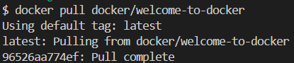

## 📌 2️⃣ Analyse et exécution de `docker/welcome-to-docker`

Avant d’exécuter le conteneur, nous avons **analysé l’image** via Docker Desktop.

📸 **Analyse de l’image dans Docker Desktop :**  
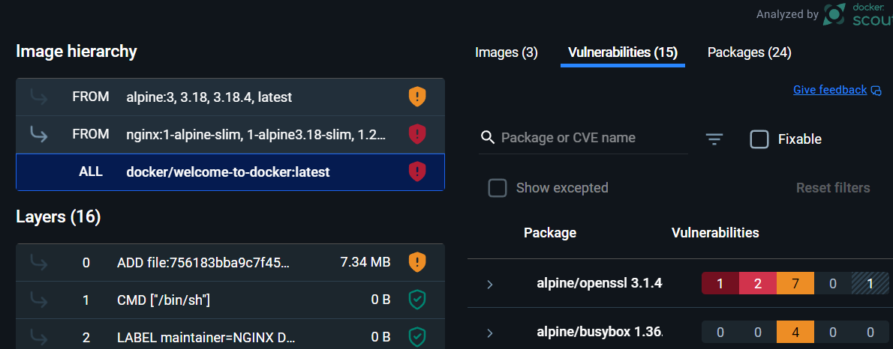

### ✅ Explication :
- Permet de **visualiser les couches du Dockerfile**.
- Affiche les **ports exposés** et la configuration.
- Identifie d’éventuelles **vulnérabilités** dans l’image.

### ✅ Exécution du conteneur

Nous avons lancé le conteneur avec la commande :

```sh
docker run -d -p 8080:80 docker/welcome-to-docker
```
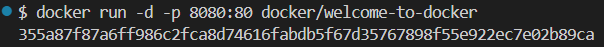

## 📌 3️⃣ Vérification du conteneur avec `docker ps`

Après l’exécution du conteneur, nous avons vérifié s’il est bien en cours d’exécution avec :

```sh
docker ps
```
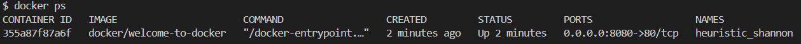

## 📌 4️⃣ Accéder au conteneur et explorer son contenu

### ✅ Donnez un nom personnalisé au conteneur

Par défaut, si nous ne spécifions pas de nom, Docker attribue un **nom aléatoire** au conteneur, comme `heuristic_shannon`.  
Pour éviter cela, nous pouvons lancer le conteneur avec un nom défini :

```sh
docker run -d -p 8080:80 --name welcome-container docker/welcome-to-docker
```
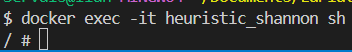

## 📌 5️⃣ Modifier un fichier dans le conteneur et voir le résultat

Nous avons accédé à notre conteneur et trouvé l’emplacement des fichiers HTML avec :

```sh
ls -la /usr/share/nginx/html/
```
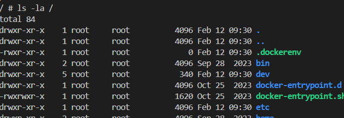

### ✅ Modification du fichier index.html
Nous avons remplacé son contenu par un message personnalisé avec la commande :

```sh
echo "Bonjour depuis Docker !" > /usr/share/nginx/html/index.html
```
Puis, nous avons vérifié que la modification a bien été prise en compte avec :
```sh
cat /usr/share/nginx/html/index.html
```
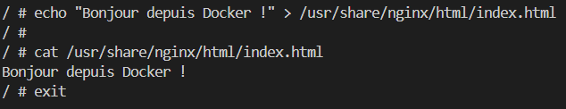

## 📌 6️⃣ Analyse du `Dockerfile` et persistance avec Docker Volume

### ✅ Analyse du `Dockerfile`

Nous avons affiché le contenu du `Dockerfile` avec :

```sh
cat Dockerfile
```

### 📌 Vérification et test du volume Docker

### ✅ Vérification du montage du volume

Nous avons vérifié que le volume était bien actif avec :

```sh
docker inspect welcome-container
```
## 📌 7️⃣ Correction du montage du volume Docker

Nous avons constaté que **le volume était inversé** :  
Docker montait **un volume interne** au lieu d'utiliser notre dossier local.

### ✅ Vérification du montage incorrect

Nous avons utilisé la commande :

```sh
docker inspect welcome-container
```
## ✅ Suppression et recréation du conteneur avec le bon volume

Nous avons supprimé et recréé le conteneur en **corrigeant le montage du volume** :

```sh
docker stop welcome-container
docker rm welcome-container
docker run -d -p 8080:80 --name welcome-container -v "C:/Users/Servais/Documents/LaPlateforme/Job02/html:/usr/share/nginx/html" docker/welcome-to-docker
```
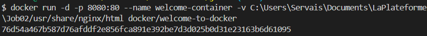

✅ Vérification du fichier monté dans le conteneur

```sh
docker exec -it welcome-container ls -la usr/share/nginx/html/
docker exec -it welcome-container cat usr/share/nginx/html/index.html
```
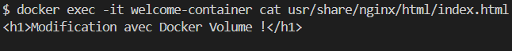

# 📦🐳 Publication de l'image Docker sur Docker Hub

Maintenant que l’image fonctionne localement, nous avons procédé à sa publication sur Docker Hub.

---

## ✅ 1. Se connecter à Docker Hub

Avant de pousser une image, il faut être **connecté à Docker Hub**.  

```sh
docker login
```
(Si vous êtes déjà connecté à Docker Desktop, cette étape peut être optionnelle.)

## ✅ 2. Créer une image Docker à partir du conteneur

Nous avons vérifié l'ID du conteneur en exécutant :

```sh
docker ps
```
Puis nous avons transformé notre conteneur en image Docker :

```sh
docker commit <ID_DU_CONTENEUR> ilanunderscore/welcome-docker
```
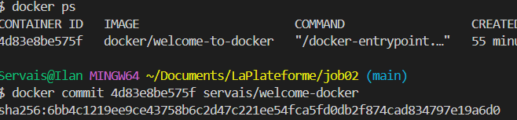

## ✅ 3. Taguer l’image pour Docker Hub

Avant de la pousser sur Docker Hub, nous avons ajouté un "tag" correspondant à notre identifiant Docker Hub :

```sh
docker tag welcome-docker ilanunderscore/welcome-docker:latest
```
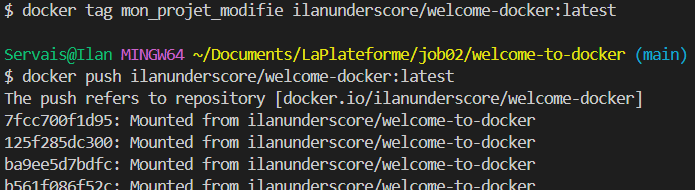

## ✅ 4. Envoyer l’image sur Docker Hub

Nous avons ensuite poussé l’image sur Docker Hub avec :

```sh
docker push ilanunderscore/welcome-docker:latest
```
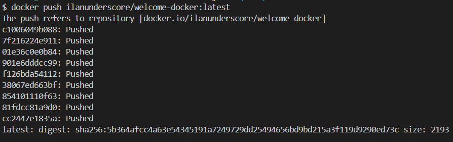

## ✅ 5. Vérifier l’image sur Docker Hub

Nous avons vérifié que l’image était bien publiée en allant sur :  
🔗 Docker Hub - ilanunderscore/welcome-docker

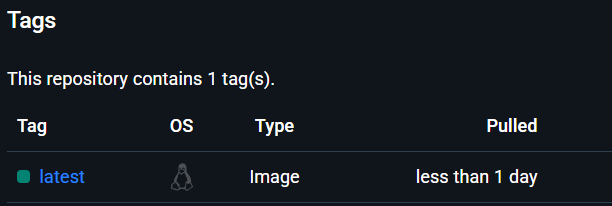

## ✅ 6. Tester une image Docker depuis une autre source

Dans le cadre de notre apprentissage Docker, nous avons également testé l’exécution d’une image Docker créée par une collègue : **`saabs/welcome-to-docker`**.

### ✅ Lancer l’image d’un autre utilisateur

Nous avons utilisé la commande suivante pour exécuter l’image de `saabs` :

```sh
docker run -d -p 8088:80 saabs/welcome-to-docker
```
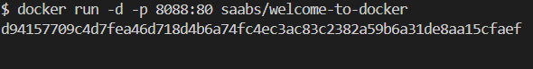

## ✅ 7. Construire et exécuter une image modifiée
Nous avons également testé la reconstruction d’une image Docker basée sur celle de saabs.

# ✅ Construire une nouvelle image basée sur saabs/welcome-to-docker
Nous avons utilisé la commande suivante pour construire l’image :

```sh
docker build -t saabs/welcome-to-docker .
```
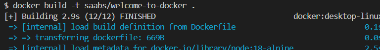

Ensuite, nous avons exécuté cette image en modifiant le port pour éviter tout conflit :

```sh
docker run -d -p 8089:3000 saabs/welcome-to-docker
```
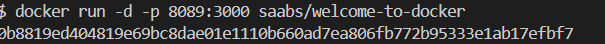

Nous avons accédé à notre version modifiée sur http://localhost:8089.

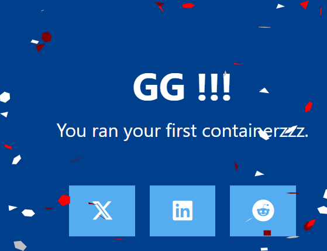

## 🚀 8. Publication de l’image modifiée sur Docker Hub
Après avoir validé notre version modifiée en local, nous avons décidé de la publier sur Docker Hub pour la rendre accessible à d'autres membres de notre promo.

### ✅ Nettoyage de l’environnement

Avant de reconstruire l’image proprement, nous avons supprimé les anciennes versions :

```sh
docker stop $(docker ps -aq)  # Arrêter tous les conteneurs
docker rm $(docker ps -aq)    # Supprimer tous les conteneurs
docker image prune -a -f      # Supprimer les images inutilisées
```

### ✅ Reconstruction de l’image modifiée
Nous avons ensuite reconstruit notre image sous un nouveau nom :

```sh
docker build -t projet_terminer .
```
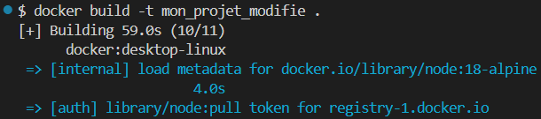

### ✅ Connexion à Docker Hub

Pour pouvoir envoyer notre image, nous avons d'abord vérifié notre connexion :

```sh
docker login
```
Si nécessaire, nous avons entré nos identifiants Docker Hub.

### ✅ Tag de l’image pour Docker Hub

Docker Hub exige que les images suivent un format spécifique (<dockerhub_username>/<image_name>:tag). 
Nous avons donc renommé notre image avant de l’envoyer :

```sh
docker tag projet_terminer mon_dockerhub_username/projet_terminer:latest
```
### ✅ Push de l’image sur Docker Hub

Une fois l’image taguée, nous l’avons publiée sur Docker Hub :

```sh
docker push mon_dockerhub_username/projet_terminer:latest
```

## 📥 Récupération et exécution de l’image par un autre utilisateur

Un membre de notre promo a pu télécharger et exécuter l’image avec ces commandes :

```sh
docker pull mon_dockerhub_username/projet_terminer:latest
docker run -d -p 8089:3000 mon_dockerhub_username/projet_terminer
```


Nous avons ainsi validé que notre image modifiée était bien accessible depuis Docker Hub et fonctionnelle sur une autre machine.

# 🎯 Conclusion

Dans ce projet, nous avons appris à :

✅Télécharger et exécuter une image existante depuis Docker Hub.  
✅Modifier une image Docker en changeant son contenu.  
✅Recréer une image Docker personnalisée.  
✅Publier cette image sur Docker Hub.  
✅Partager notre image avec un autre membre de notre promo et valider son bon fonctionnement.  
✅Docker nous permet donc d’automatiser la création et le partage d’environnements de développement, tout en assurant une portabilité maximale. 🚀
