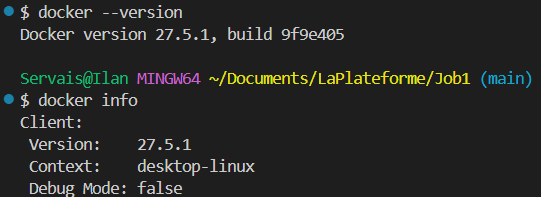
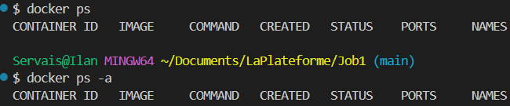
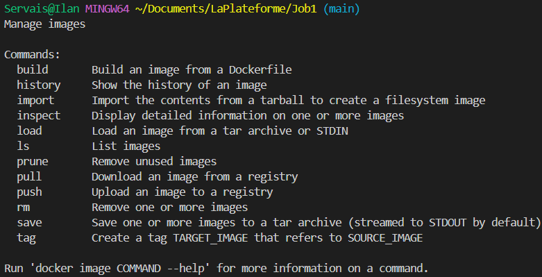
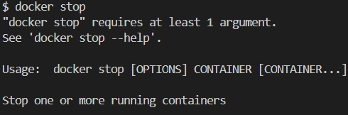
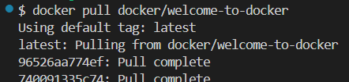
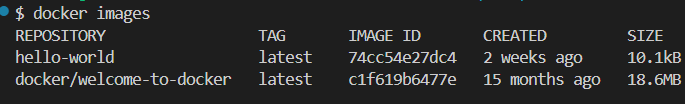
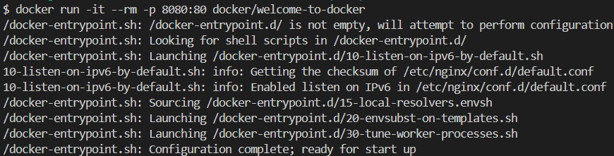
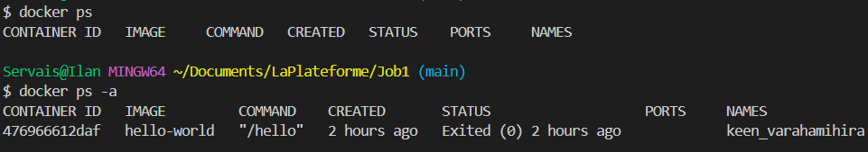
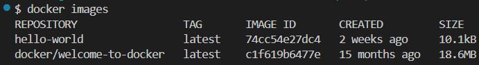
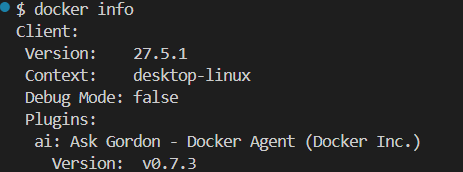

# 📦 Installation de Docker

Ce projet documente l'installation et la configuration de Docker sur notre système.

## 🔹 Vérification de l'installation

Après l'installation de Docker, nous avons utilisé les commandes suivantes pour vérifier sa bonne installation :

```sh
docker --version
docker info
```

La commande `docker --version` nous affiche la version installée, tandis que `docker info` donne plus de détails sur la configuration de Docker.



## 🔹 Affichage des conteneurs actifs

Pour voir les conteneurs Docker en cours d’exécution (et y compris ceux qui sont arrêtés avec -a) :

```sh
docker ps
docker ps -a
```


## 🔹 Gestion des images Docker

Docker propose plusieurs commandes pour gérer les images. En exécutant simplement :

```sh
docker image
```



## 🔹 Exécution d'un conteneur avec `docker run`

La commande `docker run` permet de démarrer un conteneur à partir d'une image Docker.

### ✅ Exécution simple
Nous avons testé avec une image simple pour valider le bon fonctionnement de Docker :

```sh
docker run hello-world
```


## 🔹 Arrêter un conteneur avec `docker stop`

Lorsqu'un conteneur Docker tourne en arrière-plan, il peut être arrêté proprement avec la commande :

```sh
docker stop NOM_DU_CONTENEUR
```



## 🔹 Récupérer l’image "welcome-to-docker" avec `docker pull`

Nous avons utilisé la commande `docker pull` pour récupérer une image de démonstration fournie par Docker :

```sh
docker pull docker/welcome-to-docker
```



## 🔹 Afficher les images disponibles avec `docker images`

Après avoir récupéré des images avec `docker pull`, nous avons utilisé la commande suivante pour voir la liste des images disponibles localement :

```sh
docker images
```



## 🔹 Construire et exécuter un conteneur avec `docker run`

Nous avons utilisé la commande `docker run` pour exécuter notre conteneur et le rendre accessible via un navigateur à l'adresse http://localhost:8080

### ✅ Lancer le conteneur

```sh
docker run -it --rm -p 8080:80 docker/welcome-to-docker
```



## 🔹 Vérification de l'état des conteneurs et des images Docker

Après avoir lancé un conteneur, nous avons utilisé plusieurs commandes pour inspecter son état et obtenir des informations sur Docker.

---

### ✅ Afficher les conteneurs actifs avec `docker ps`

La commande suivante permet de voir **tous les conteneurs en cours d’exécution** :

```sh
docker ps
```



## 🔹 Vérification des images et des informations Docker

Après avoir récupéré des images Docker et exécuté des conteneurs, nous avons utilisé plusieurs commandes pour inspecter leur état et obtenir des informations sur Docker.

---

### ✅ Voir les images disponibles avec `docker images`

La commande suivante permet d'afficher toutes les images Docker stockées localement :

```sh
docker images
```


La commande suivante permet d'afficher des informations 

```sh
docker info
```


